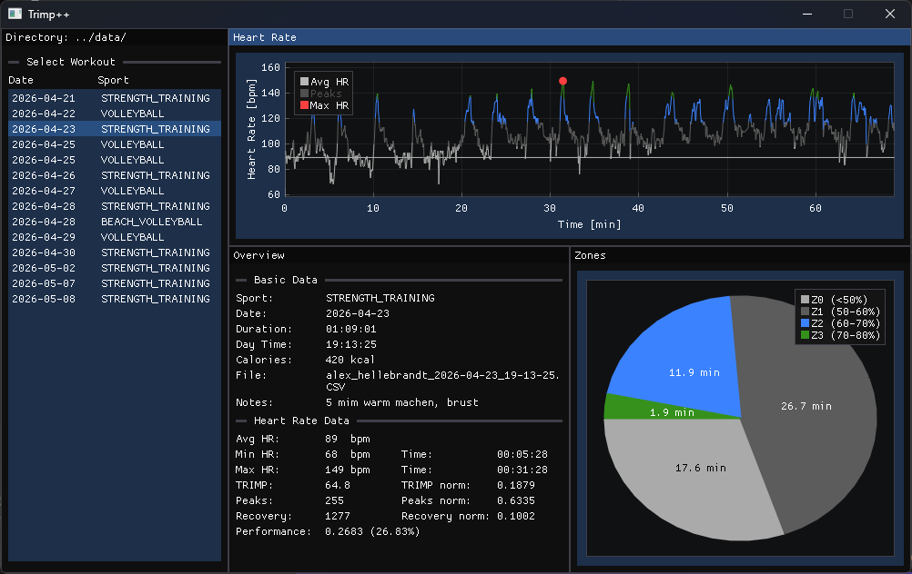

# Trimp++ 

Trimp++ ist eine performante C++ Anwendung zur Analyse und Visualisierung von Herzfrequenzdaten aus Sport-Workouts (CSV-Dateien). Die Software berechnet wichtige sportwissenschaftliche Kennzahlen wie den **TRIMP** (Training Impulse) und bietet eine grafische Oberfläche zur Auswertung von Trainingszonen und Belastungspeaks.




## Features

- **Polar CSV-Parser:** Direktes Einlesen und Verarbeiten von standardmäßigen Herzfrequenz-Exporten der Polar-Flow.
- **Interaktive Graphen:** Visualisierung des Herzfrequenzverlaufs über die Zeit mit zonenbasierter Einfärbung der Kurve.
- **Peak-Erkennung:** Intelligenter Algorithmus zur Erkennung von echten Belastungsspitzen (fängt auch konstante Herzfrequenz-Plateaus fehlerfrei ab).
- **Zonen-Auswertung:** Präzise Aufschlüsselung der Trainingsdauer in den einzelnen Intensitätszonen.
- **Interaktive Legende:** Ein- und Ausblenden von Durchschnittslinie, Peaks und Max HR direkt über die Plot-Legende.
- **Sportwissenschaftliche Metriken:**
  - Berechnung des Trainingsimpulses (**TRIMP**).
  - Ermittlung von Durchschnitts-, Minimal- und Maximal-Herzfrequenz samt präzisem Zeitstempel.
  - Berechnung von Anzahl der Peaks.
  - Auswertung von Erholungsherzfrequenz (Recovery) und Performance-Scores.

## Benutzeroberfläche (UI)

Die Anwendung ist in vier funktionale Fenster unterteilt:
1. **Selection Window:** Auswahl und Laden der CSV-Dateien aus dem Datenverzeichnis.
2. **Training Overview:** Kompakter Überblick über Metriken wie TRIMP, Peaks und Erholung.
3. **Zone Window:** Tabellarische oder grafische Übersicht der Verweildauer in den Herzfrequenzzonen.
4. **Heart Rate Plot:** Der Hauptgraph (unterstützt durch `ImPlot`) zur detaillierten Kurvenanalyse.

## Voraussetzungen & Tech-Stack

- **Sprache:** C++20 (oder höher)
- **Frameworks & Bibliotheken:**
  - **SDL3**
  - **Dear ImGui**
  - **ImPlot**
- **Unterstützte Betriebssysteme:** Windows (MSVC / Visual Studio), Linux, macOS

## Projektstruktur

```text
├── src/
│   ├── main.cpp                 # Einstiegspunkt der Anwendung
│   ├── Application.cpp/.h       # App-Lifecycle & Hauptschleife
│   ├── DataManager.cpp/.h       # CSV-Parser, Peak-Erkennung & TRIMP-Logik
│   ├── GUI.cpp/.h               # ImGui & ImPlot Fenster-Layouts
│   └── Display.cpp/.h           # SDL3 Window- & Renderer-Wrapper
├── data/                        # Verzeichnis für deine Workout-CSV-Dateien
└── README.md
